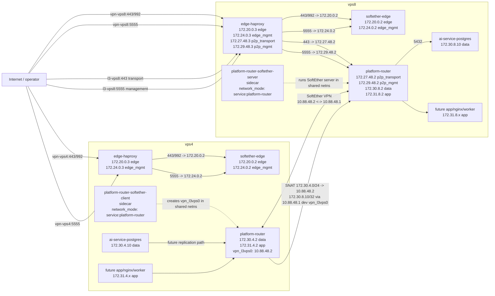

# vps4 -> vps8 Network Scheme

This diagram captures the current and planned container/network layout for
PostgreSQL transport testing between `vps4` and `vps8`.

`edge-haproxy` is the shared public SNI switch, but `vpn-vpsN` and `l3-vpsN`
route to different runtime containers and different Docker networks:

- `vpn-vpsN:443/992` -> `softether-edge` on `172.20.0.2`.
- `vpn-vpsN:5555` -> `softether-edge` management on `172.24.0.2`.
- `l3-vps8:443` -> `platform-router` shared netns on `172.27.48.2`.
- `l3-vps8:5555` -> `platform-router` shared netns management on `172.29.48.2`.



## Notes

- `softether-edge` serves mandatory public VPN ingress only.
- `softether_l3_vps` is the link/secrets source of truth. For this link,
  SoftEther runtime runs as platform-router sidecars, not standalone dataplane
  containers.
- Platform services must not attach directly to transport networks.
- On the source side, the L3 client runs as `platform-router-softether-client`
  with `network_mode: service:platform-router`. It creates `vpn_l3vps0` inside
  the `platform-router` network namespace. The old source-side Docker handoff
  network `172.28.48.0/24` is legacy for this link and is not part of the
  PostgreSQL datapath.
- On the target side, the L3 server runs as `platform-router-softether-server`
  with `network_mode: service:platform-router`. Public L3 transport and
  management backend IPs are owned by `platform-router`.
- `platform-router` v1 uses a narrow source-side service SNAT only for the
  first PostgreSQL policy: `172.30.4.0/24 -> 172.30.8.10:5432` is rewritten to
  `10.88.48.2` before entering `vpn_l3vps0`. There is no broad MASQUERADE.
- The expected SoftEther client IPv4 identity is `10.88.48.2`. The proven
  PostgreSQL observed source is `172.30.8.2`.
- `postgres_runtime` prepares `vps8` pg_hba for future replication from
  `172.30.8.2/32`; this sidecar model does not need a PostgreSQL return route
  for `172.27.48.2`.
- Inter-VPS service reachability should use:

```text
platform service -> platform_router -> L3/P2P transport -> platform_router -> platform service
```

- Public L3 VPS management is exposed only on aliases running an L3 VPS server.
  For the first link, that is `l3-vps8.mine-craft.su:5555`.
- The first `platform_router` policy is intentionally narrow:
  `vps4 -> vps8 172.30.8.10:5432`.
