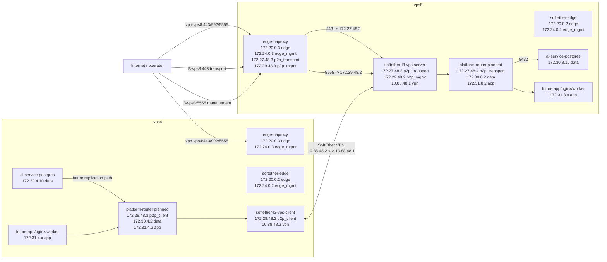

# vps4 -> vps8 Network Scheme

This diagram captures the planned container and network layout for PostgreSQL
transport testing between `vps4` and `vps8`.



## Notes

- `softether-l3-vps-*` is transport only.
- Platform services must not attach directly to transport networks.
- Inter-VPS service reachability should use:

```text
platform service -> platform_router -> L3/P2P transport -> platform_router -> platform service
```

- Public P2P management is exposed only on aliases running a P2P server.
  For the first link, that is `l3-vps8.mine-craft.su:5555`.
