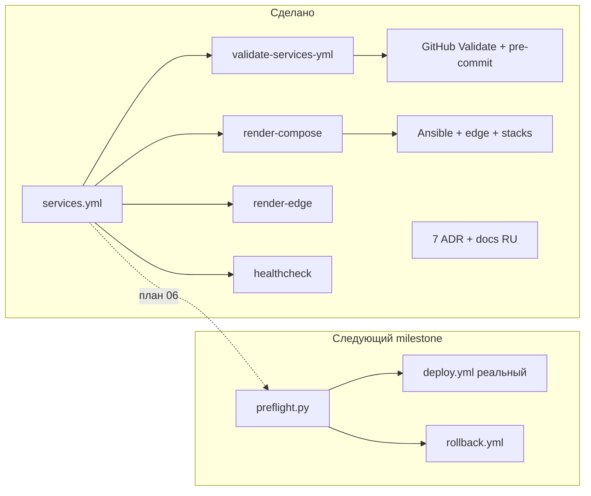

# Обзор работы над AI Service Platform

Снапшот состояния репозитория на ветке **`codex/feature/prepare02`** (май 2026).

## Контекст

`AI_Service_Platform` — **оркестратор инфраструктуры** без продуктового кода. Продукты живут в `AromaFlowAI` и `AI_E_Retail`; платформа владеет `services.yml`, edge, стеками, Ansible и CI.

Относительно `main`: **18 коммитов**, **~10 586 строк** в **125 файлах**.

## Хронология (кто и что)

| Фаза | Автор | Содержание |
|------|--------|------------|
| Старт | Ri Ga | `Begin`, `Prepare`, `Prepare CDN` — задел под CDN/GeoPolicy |
| Основной объём | Replit Agent (`airiga1897`) | Валидатор, render-compose, healthcheck, ADR, Ansible, edge, CI, перевод docs |
| Cursor | Ri Ga | Коммит `Step #6`: промт в [`../../codex/plans/01-cursor-deploy-rollback-next-step.md`](../../codex/plans/01-cursor-deploy-rollback-next-step.md) |

Replit-сессия шла по планам в [`../../replit/plans/`](../../replit/plans/) (задачи #1–#5 выполнены, #6 — только документ).

## Что уже сделано

### Архитектурный фундамент

- **7 ADR** в [`../../adr/`](../../adr/README.md): infra-only repo, 4 runtime-инстанса, расширяемый каталог, edge (HAProxy/Nginx/SoftEther), deploy из immutable image refs, GeoPolicy.
- [`services.yml`](../../../services.yml) (~525 строк) — единый реестр: VPS1–3, SoftEther, 4 `runtime_instances`, проекты, healthcheck, deploy-заготовки.
- Документация на русском: README, ARCHITECTURE, RUNBOOKS, CI_CD, DEPLOYMENT, SOFTETHER_VPN, CDN_GEO_POLICY и др.

### Цепочка «канон → артефакты → проверки»

| Инструмент | Назначение |
|------------|------------|
| [`tools/validate-services-yml/`](../../../tools/validate-services-yml/) | Strict-валидация `services.yml`, фикстуры, unit-тесты |
| [`tools/render-compose/`](../../../tools/render-compose/) | Генерация `infra/stacks/*/docker-compose.*.yml` |
| [`tools/render-edge/`](../../../tools/render-edge/) | HAProxy + per-site Nginx из `services.yml` |
| [`tools/healthcheck/`](../../../tools/healthcheck/) | CLI опроса `/health/` по инстансам |
| [`tools/_lib/registry.py`](../../../tools/_lib/registry.py) | Общая загрузка реестра |

Локально и в CI: **`make check`** = validate + render-check + render-edge-check + test ([`Makefile`](../../../Makefile)).

### CI и инфраструктура

- [`.github/workflows/validate.yml`](../../../.github/workflows/validate.yml) — на PR/push в `main`.
- [`.pre-commit-config.yaml`](../../../.pre-commit-config.yaml) — те же проверки до коммита/push.
- **4 стека** в [`infra/stacks/`](../../../infra/stacks/).
- **Edge**: HAProxy, nginx sites, SoftEther examples в [`infra/edge/`](../../../infra/edge/).
- **Ansible**: [`infra/ansible/site.yml`](../../../infra/ansible/site.yml) — docker, backup, monitoring, security, management, Semaphore.

## Что ещё не сделано

По [ADR-0006](../../adr/0006-deploy-from-immutable-image-refs.md) политика «деплой только image ref» **задекларирована**, но **процесса деплоя нет**:

| Компонент | Статус |
|-----------|--------|
| [`.github/workflows/deploy.yml`](../../../.github/workflows/deploy.yml) | Dry-run skeleton |
| [`.github/workflows/rollback.yml`](../../../.github/workflows/rollback.yml) | Dry-run skeleton |
| `tools/deploy/preflight.py` | Не существует |
| Расширенный deploy-контракт в `services.yml` | Не добавлен (только `branches` + `environments`) |
| Реальный SSH rollout | Вне репо (секреты, inventory) — намеренно |

Первый безопасный сценарий: **`ai-retail-dev` → `preprod` → VPS2**. Детали — в [`01-codex-deploy-rollback-proposal.md`](01-codex-deploy-rollback-proposal.md) и [`../../codex/plans/01-cursor-deploy-rollback-next-step.md`](../../codex/plans/01-cursor-deploy-rollback-next-step.md).

## Оценка

**Сильные стороны:** единый `services.yml` → валидатор → генераторы → CI; ADR согласованы с кодом; тесты у инструментов; границы репозитория соблюдены.

**Зоны внимания:** дубли в git-истории (validator/healthcheck); несколько параллельных веток (`cursor/`, `codex/`, `replit/` prepare01); `deploy.yml` принимает `target_vps` вручную — preflight должен брать VPS из реестра.

## Рекомендуемые следующие шаги

1. PR `codex/feature/prepare02` → `main` (infra-MVP).
2. Реализовать deploy/rollback по [`01-codex-deploy-rollback-proposal.md`](01-codex-deploy-rollback-proposal.md) (промт Codex + план Replit #06).
